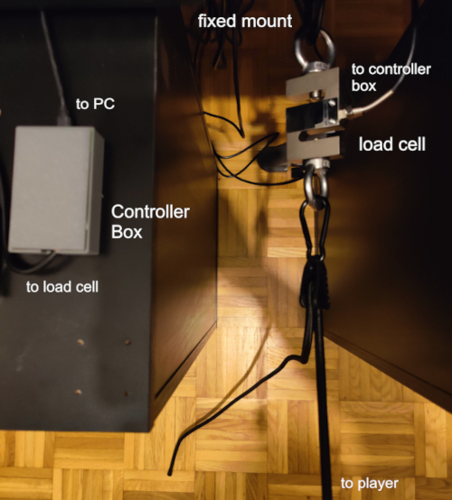
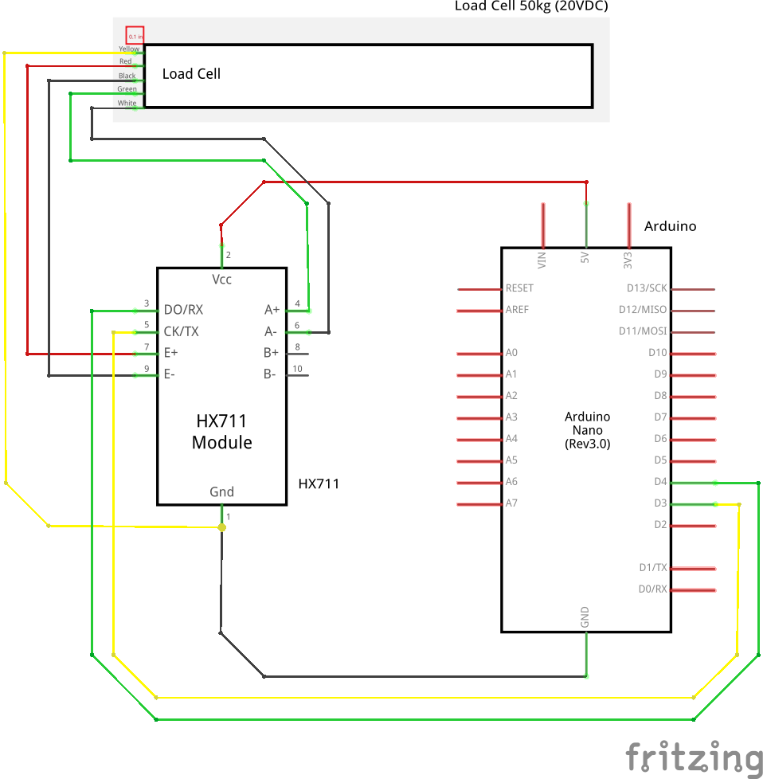

  
  <h1>MiniMile VR</h1>
  <h2>A Minimal, low-cost DIY VR treadmill system</h2>

  
  
  
  

## What is MiniMile VR?
MiniMile VR is an answer to the demand for more affordable immersion enhancing VR devices. It is a minimal, low-cost VR treadmill system, which allows for more immersive smooth movement in Steam VR applications than a controller can provide.

You can mount the system to a wall or another sturdy part of your playspace. A rubber rope then connects your waist with the mounting point holding you approximately in space, while a sensor measures how much force you use to walk or run away from the mounting point. In addition to a slippery floor - or simply with wearing wool socks - the setup offers a rather immersive walking/running experience.

The system currently works unidirectional in the forward direction. In the current version there is no directional information implemented (left or right motion).

MiniMile VR is currently under active development.

## Installation
Installation requires setting up the driver software on your PC and setting up the hardware.

### Installing OpenVR Driver
The OpenVR driver is required for SteamVR to detect the device as an input option for VR games. Simply double click the file "install_driver.bat" in the folder "openvr_driver". It just takes an instant and the driver is installed.

If you want to uninstall the driver, there is a file named "uninstall_driver.bat" in the same folder.

> **WARNING**  
> In the current version it is important, that you uninstall the driver before you remove or relocate the project directory. Otherwise there will be some driver leftovers in the Steam registry, which could lead to undefined behavior. In all cases you can remove the driver with "<steam-directory>/steamapps/common/SteamVR/bin/win64/Vrpathreg.exe". Run it in the console with "show" as an argument to check the full path of the left-over driver, then run it with the argument "removedriver <full-driver-path>" to remove the left-over driver.

### Setting Up the Hardware
The more involved step is building the hardware of the system. You will need the following components. The links are links of the products I used for my own design.

- [50 kg load cell](https://www.amazon.de/dp/B077YLHG9D) (S-shape to measure pull forces, not push)
- Arduino (any type will do; I used an Arduino Nano Every) - For measuring the movement forces - Sends the load cell output to the PC
- [HX711 load cell module](https://www.amazon.de/dp/B0DJX8BPQL) - Required to read out the load cell
- [Tensioning belt](https://www.amazon.de/dp/B0DRNBRWLL) - Keeps you briefly in place while moving

  

For my design I used 2 M12 eyebolts and 2 carabiners to hang the load cell between my desk and the tensioning belt. I then knotted together the other end of the belt with some terry cloth to create a soft belt around my hip.

Now you need to wire the electrical components together as in the following image.

  

- Red wire: E+
- Black wire: E-
- Yellow wire: GND
- Green wire: S+/A+
- White wire: S-/A-

The HX711 then needs to be supplied with 5V from the Arduino. Connect its CLK (yellow) with D3 and its Data Out (green) with S4.

I used a 20VDC load cell to connect to my 5V excitation supply, wich worked perfectly fine.

After wiring everything, connect the Arduino to your PC with an USB cable. Now you need to upload the Arduino sketch "load_cell_module/load_cell_module.ino" to the Arduino. I suggest you use the official [Arduino IDE](https://www.arduino.cc/en/software/) for that. Compilation requires the HX711 Arduino library by Rob Tillaart.

> **Note**
> Additionally, the path "load_cell_module\case contains" stl and sliced gcode files to 3d-print a small case for the controllers. The lid of the case can be placed with double sided tape.

## Project Structure (Folders)
    - docs: Images of the project setup, wiring, etc.
    - load_cell_module: Contains everything regarding hardware.
      - case: Files for printing the case for the Arduino Nano and teh HX711 module
      - validation: Some Python scripts for validating the treadmill device
    - openvr_driver: Contains everything regarding the driver software.
      - CustomTreadmillDriver: The driver in its release shape
      - openvr_treadmill_driver_src: The source code of the treadmill driver

## References
  - OpenVR SteamVR driver documentation - https://github.com/ValveSoftware/openvr/wiki/Driver-Documentation
  - Finallyfunctionals OpenVR driver example - https://github.com/finallyfunctional/openvr-driver-example/tree/main